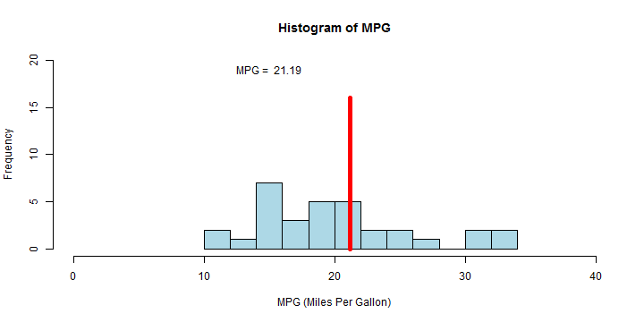

## Summary

This shiny app is based on mtcars data set. It uses four parameters to predict a car's mpg.

1. Transmission type (Automatic, Manual) 
2. Number of cylinders (4, 6, 8) 
3. Horsepower
4. Weight (1000 lbs)


```r
library(slidifyLibraries); library(slidify); data(mtcars); head(mtcars, n = 3)
```

```
##                mpg cyl disp  hp drat    wt  qsec vs am gear carb
## Mazda RX4     21.0   6  160 110 3.90 2.620 16.46  0  1    4    4
## Mazda RX4 Wag 21.0   6  160 110 3.90 2.875 17.02  0  1    4    4
## Datsun 710    22.8   4  108  93 3.85 2.320 18.61  1  1    4    1
```

---

## Mtcars Data and Pre-processing


```r
# convert variables to factor
mtcars$am <- factor(mtcars$am, labels = c("Auto", "Manual"))
mtcars$cyl <- as.factor(mtcars$cyl)

# select variables needed for linear fit
tidy <- mtcars[, c(9, 2, 4, 6, 1)]
head(tidy, n = 3)
```

```
##                   am cyl  hp    wt  mpg
## Mazda RX4     Manual   6 110 2.620 21.0
## Mazda RX4 Wag Manual   6 110 2.875 21.0
## Datsun 710    Manual   4  93 2.320 22.8
```


---

## Linear Regression

The interaction between transmission type and weight is included in the linear model.


```r
# linear fit
fit <- lm(mpg ~ am + cyl + hp + wt + am:wt, data = tidy)
fit
```

```
## 
## Call:
## lm(formula = mpg ~ am + cyl + hp + wt + am:wt, data = tidy)
## 
## Coefficients:
## (Intercept)     amManual         cyl6         cyl8           hp  
##    30.65247      9.89860     -2.38062     -2.89911     -0.01782  
##          wt  amManual:wt  
##    -2.20687     -3.14499
```

---

## Prediction Example


```r
am <- "Auto"; cyl <- "6"; hp <- 150; wt <- 2.0
a <- data.frame(am = am, cyl = cyl, hp = hp, wt = wt)
mpgPred <- predict(fit, a)
```

The x coordinate value of the red vertical line is the predicted mpg.



---
